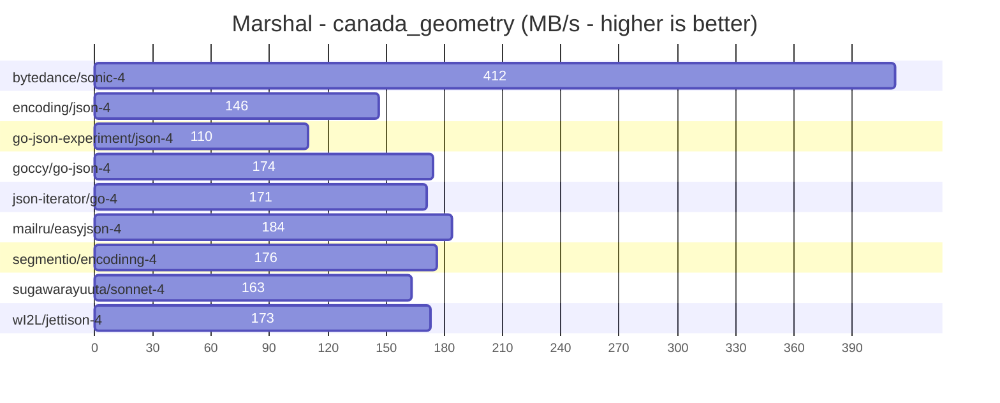
```mermaid
gantt
title Marshal - canada_geometry (MB/s - higher is better)
dateFormat X
axisFormat %s

section bytedance/sonic-4                 
412 :0, 412
section encoding/json-4         
146 :0, 146
section go-json-experiment/json-4         
110 :0, 110
section goccy/go-json-4                   
174 :0, 174
section json-iterator/go-4                
171 :0, 171
section mailru/easyjson-4                 
184 :0, 184
section segmentio/encodinng-4             
176 :0, 176
section sugawarayuuta/sonnet-4            
163 :0, 163
section wI2L/jettison-4                   
173 :0, 173
```

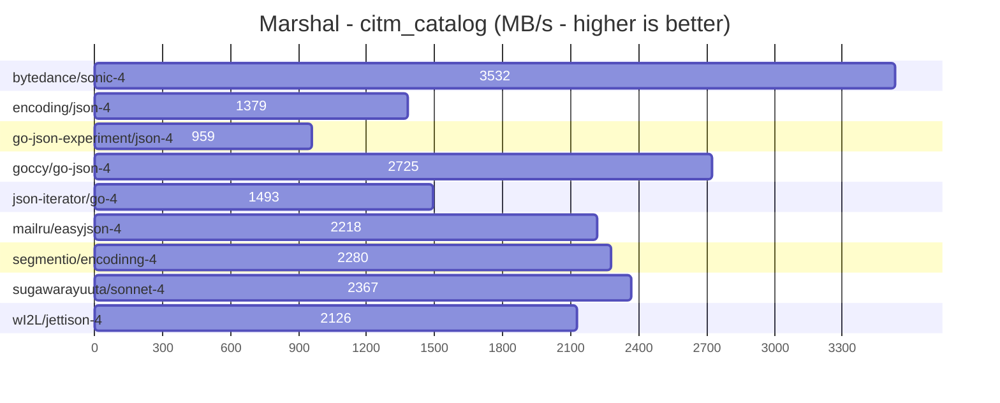
```mermaid
gantt
title Marshal - citm_catalog (MB/s - higher is better)
dateFormat X
axisFormat %s

section bytedance/sonic-4                    
3532 :0, 3532
section encoding/json-4                      
1379 :0, 1379
section go-json-experiment/json-4            
959 :0, 959
section goccy/go-json-4                      
2725 :0, 2725
section json-iterator/go-4                   
1493 :0, 1493
section mailru/easyjson-4                    
2218 :0, 2218
section segmentio/encodinng-4                
2280 :0, 2280
section sugawarayuuta/sonnet-4               
2367 :0, 2367
section wI2L/jettison-4                      
2126 :0, 2126
```

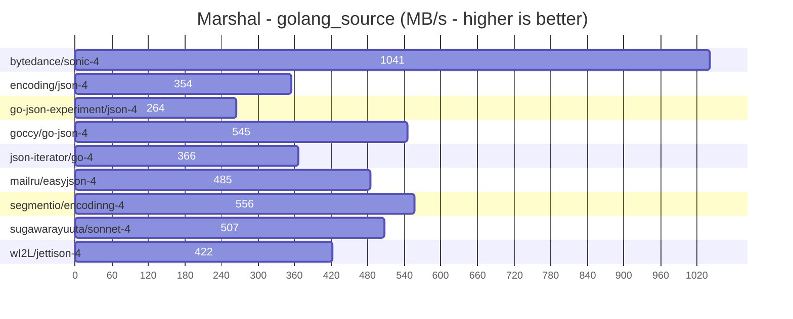
```mermaid
gantt
title Marshal - golang_source (MB/s - higher is better)
dateFormat X
axisFormat %s

section bytedance/sonic-4                   
1041 :0, 1041
section encoding/json-4                     
354 :0, 354
section go-json-experiment/json-4           
264 :0, 264
section goccy/go-json-4                     
545 :0, 545
section json-iterator/go-4                  
366 :0, 366
section mailru/easyjson-4                   
485 :0, 485
section segmentio/encodinng-4               
556 :0, 556
section sugawarayuuta/sonnet-4              
507 :0, 507
section wI2L/jettison-4                     
422 :0, 422
```

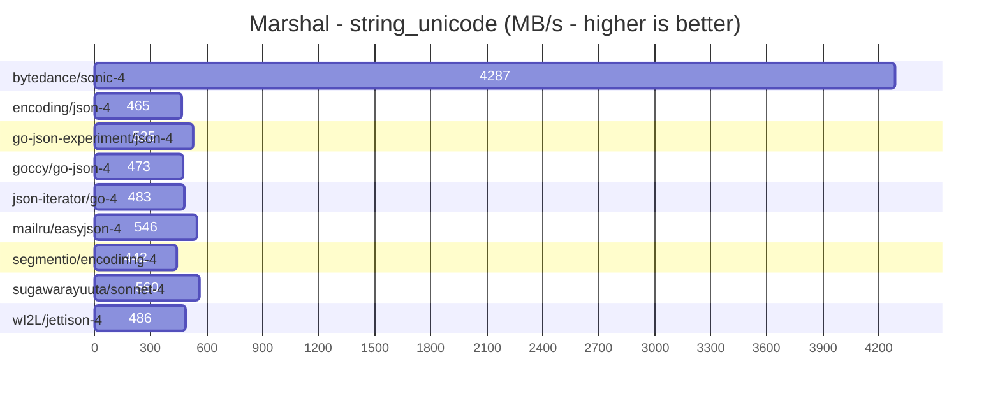
```mermaid
gantt
title Marshal - string_unicode (MB/s - higher is better)
dateFormat X
axisFormat %s

section bytedance/sonic-4                  
4287 :0, 4287
section encoding/json-4                    
465 :0, 465
section go-json-experiment/json-4          
525 :0, 525
section goccy/go-json-4                    
473 :0, 473
section json-iterator/go-4                 
483 :0, 483
section mailru/easyjson-4                  
546 :0, 546
section segmentio/encodinng-4              
442 :0, 442
section sugawarayuuta/sonnet-4             
560 :0, 560
section wI2L/jettison-4                    
486 :0, 486
```

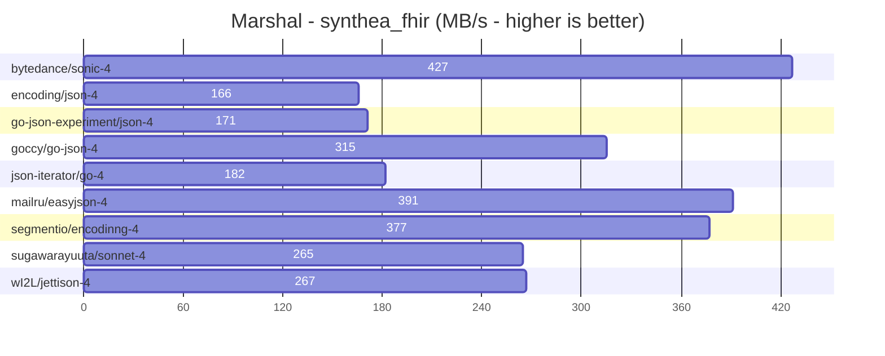
```mermaid
gantt
title Marshal - synthea_fhir (MB/s - higher is better)
dateFormat X
axisFormat %s

section bytedance/sonic-4                    
427 :0, 427
section encoding/json-4                      
166 :0, 166
section go-json-experiment/json-4            
171 :0, 171
section goccy/go-json-4                      
315 :0, 315
section json-iterator/go-4                   
182 :0, 182
section mailru/easyjson-4                    
391 :0, 391
section segmentio/encodinng-4                
377 :0, 377
section sugawarayuuta/sonnet-4               
265 :0, 265
section wI2L/jettison-4                      
267 :0, 267
```

```mermaid
gantt
title Marshal - twitter_status (MB/s - higher is better)
dateFormat X
axisFormat %s

section bytedance/sonic-4                  
2373 :0, 2373
section encoding/json-4                    
633 :0, 633
section go-json-experiment/json-4          
500 :0, 500
section goccy/go-json-4                    
1004 :0, 1004
section json-iterator/go-4                 
521 :0, 521
section mailru/easyjson-4                  
834 :0, 834
section segmentio/encodinng-4              
921 :0, 921
section sugawarayuuta/sonnet-4             
887 :0, 887
section wI2L/jettison-4                    
726 :0, 726
```

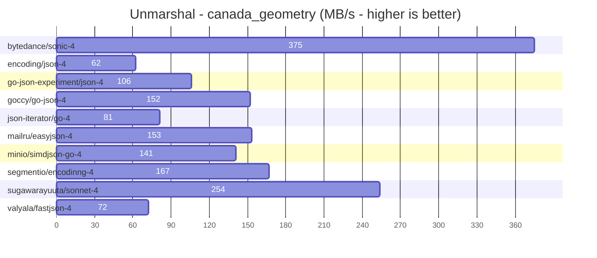
```mermaid
gantt
title Unmarshal - canada_geometry (MB/s - higher is better)
dateFormat X
axisFormat %s

section bytedance/sonic-4               
375 :0, 375
section encoding/json-4                 
62 :0, 62
section go-json-experiment/json-4       
106 :0, 106
section goccy/go-json-4                 
152 :0, 152
section json-iterator/go-4              
81 :0, 81
section mailru/easyjson-4               
153 :0, 153
section minio/simdjson-go-4             
141 :0, 141
section segmentio/encodinng-4           
167 :0, 167
section sugawarayuuta/sonnet-4          
254 :0, 254
section valyala/fastjson-4              
72 :0, 72
```

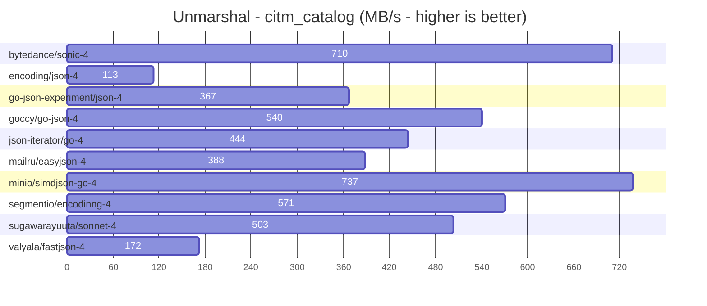
```mermaid
gantt
title Unmarshal - citm_catalog (MB/s - higher is better)
dateFormat X
axisFormat %s

section bytedance/sonic-4                  
710 :0, 710
section encoding/json-4                    
113 :0, 113
section go-json-experiment/json-4          
367 :0, 367
section goccy/go-json-4                    
540 :0, 540
section json-iterator/go-4                 
444 :0, 444
section mailru/easyjson-4                  
388 :0, 388
section minio/simdjson-go-4                
737 :0, 737
section segmentio/encodinng-4              
571 :0, 571
section sugawarayuuta/sonnet-4             
503 :0, 503
section valyala/fastjson-4                 
172 :0, 172
```

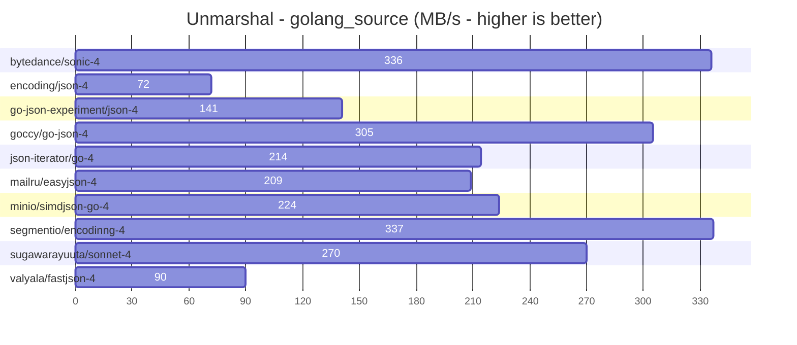
```mermaid
gantt
title Unmarshal - golang_source (MB/s - higher is better)
dateFormat X
axisFormat %s

section bytedance/sonic-4                 
336 :0, 336
section encoding/json-4                   
72 :0, 72
section go-json-experiment/json-4         
141 :0, 141
section goccy/go-json-4                   
305 :0, 305
section json-iterator/go-4                
214 :0, 214
section mailru/easyjson-4                 
209 :0, 209
section minio/simdjson-go-4               
224 :0, 224
section segmentio/encodinng-4             
337 :0, 337
section sugawarayuuta/sonnet-4            
270 :0, 270
section valyala/fastjson-4                
90 :0, 90
```

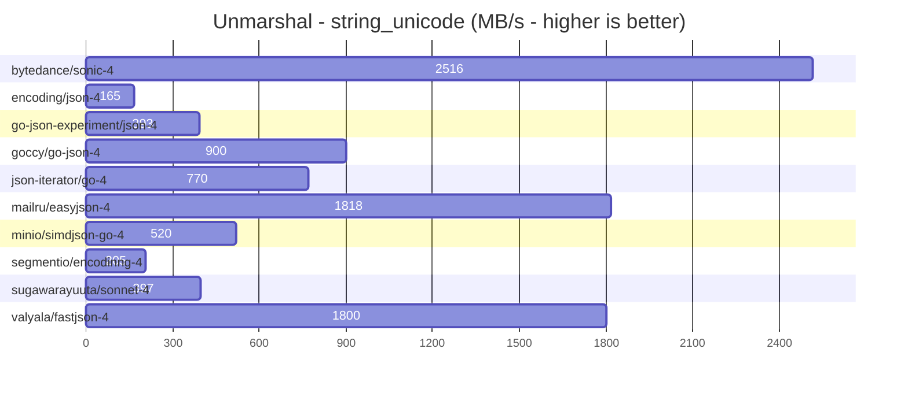
```mermaid
gantt
title Unmarshal - string_unicode (MB/s - higher is better)
dateFormat X
axisFormat %s

section bytedance/sonic-4                
2516 :0, 2516
section encoding/json-4                  
165 :0, 165
section go-json-experiment/json-4        
393 :0, 393
section goccy/go-json-4                  
900 :0, 900
section json-iterator/go-4               
770 :0, 770
section mailru/easyjson-4                
1818 :0, 1818
section minio/simdjson-go-4              
520 :0, 520
section segmentio/encodinng-4            
205 :0, 205
section sugawarayuuta/sonnet-4           
397 :0, 397
section valyala/fastjson-4               
1800 :0, 1800
```

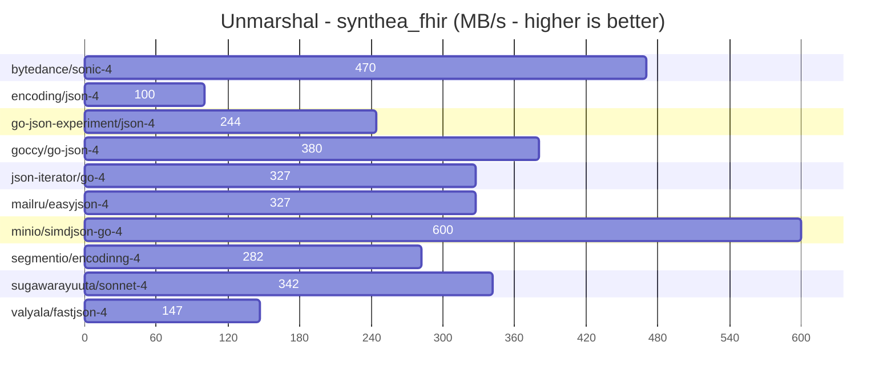
```mermaid
gantt
title Unmarshal - synthea_fhir (MB/s - higher is better)
dateFormat X
axisFormat %s

section bytedance/sonic-4                  
470 :0, 470
section encoding/json-4                    
100 :0, 100
section go-json-experiment/json-4          
244 :0, 244
section goccy/go-json-4                    
380 :0, 380
section json-iterator/go-4                 
327 :0, 327
section mailru/easyjson-4                  
327 :0, 327
section minio/simdjson-go-4                
600 :0, 600
section segmentio/encodinng-4              
282 :0, 282
section sugawarayuuta/sonnet-4             
342 :0, 342
section valyala/fastjson-4                 
147 :0, 147
```

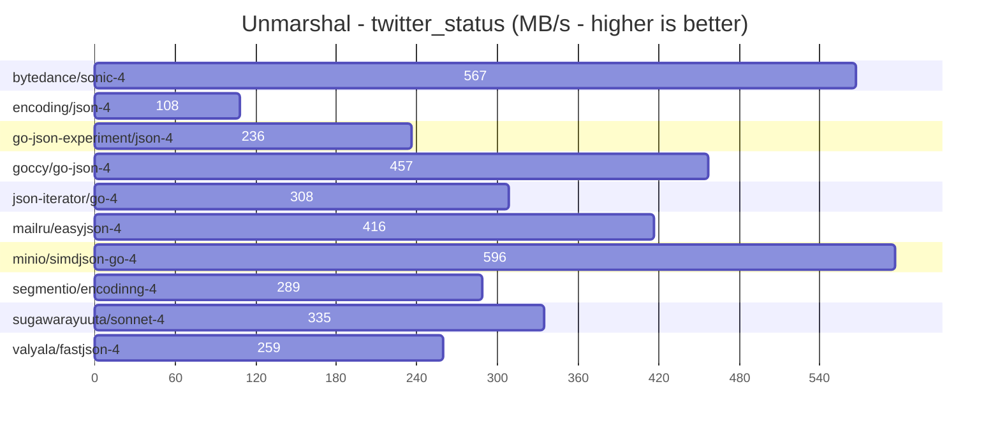
```mermaid
gantt
title Unmarshal - twitter_status (MB/s - higher is better)
dateFormat X
axisFormat %s

section bytedance/sonic-4                
567 :0, 567
section encoding/json-4                  
108 :0, 108
section go-json-experiment/json-4        
236 :0, 236
section goccy/go-json-4                  
457 :0, 457
section json-iterator/go-4               
308 :0, 308
section mailru/easyjson-4                
416 :0, 416
section minio/simdjson-go-4              
596 :0, 596
section segmentio/encodinng-4            
289 :0, 289
section sugawarayuuta/sonnet-4           
335 :0, 335
section valyala/fastjson-4               
259 :0, 259
```

