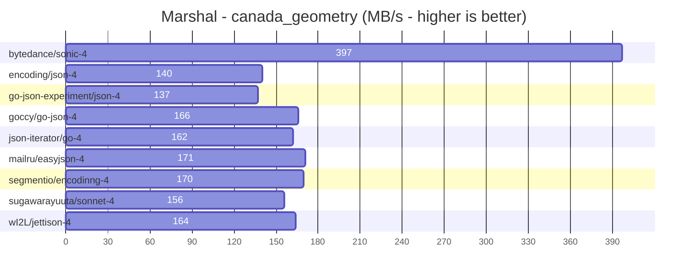
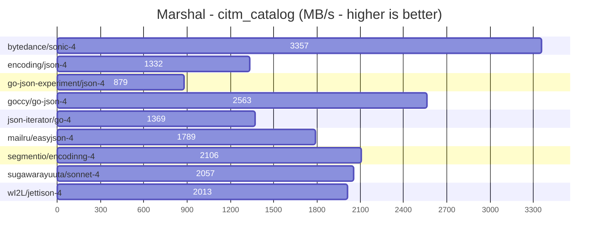
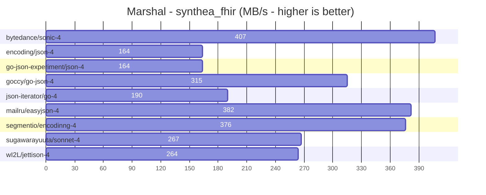
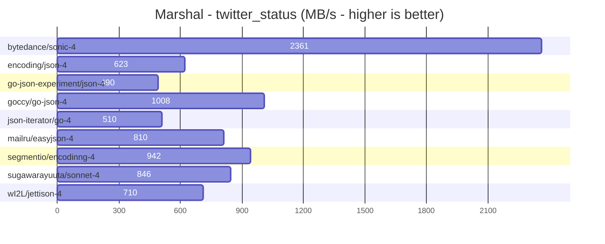
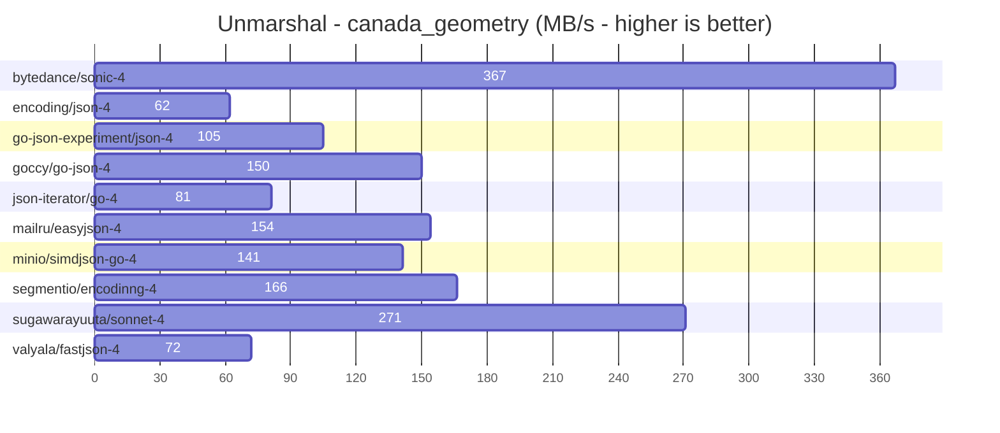
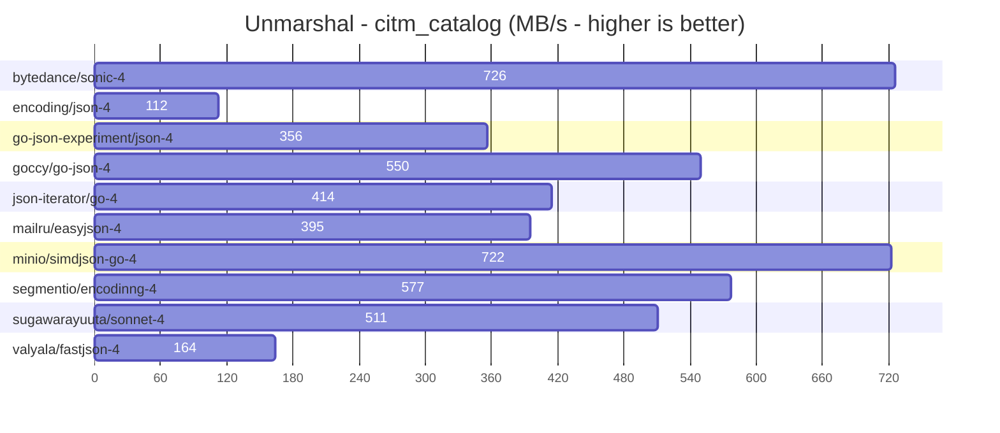
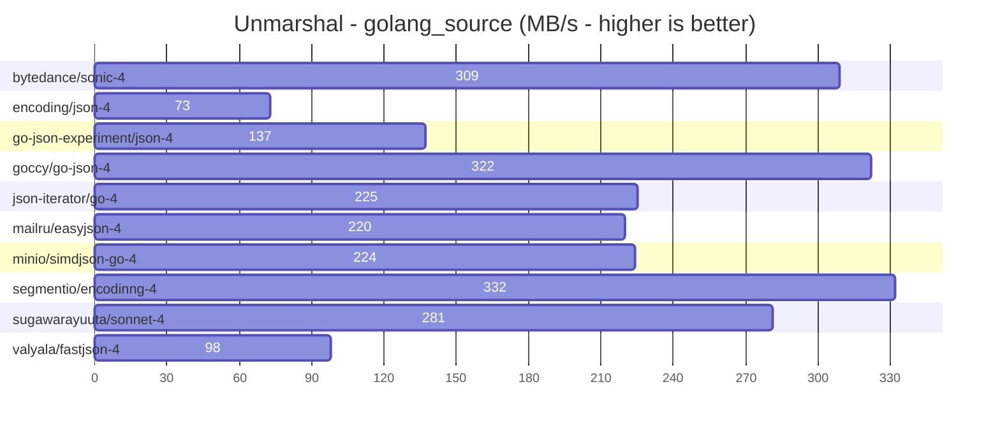
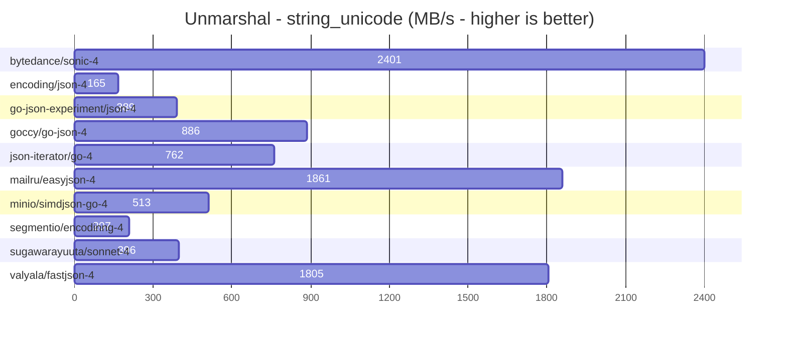
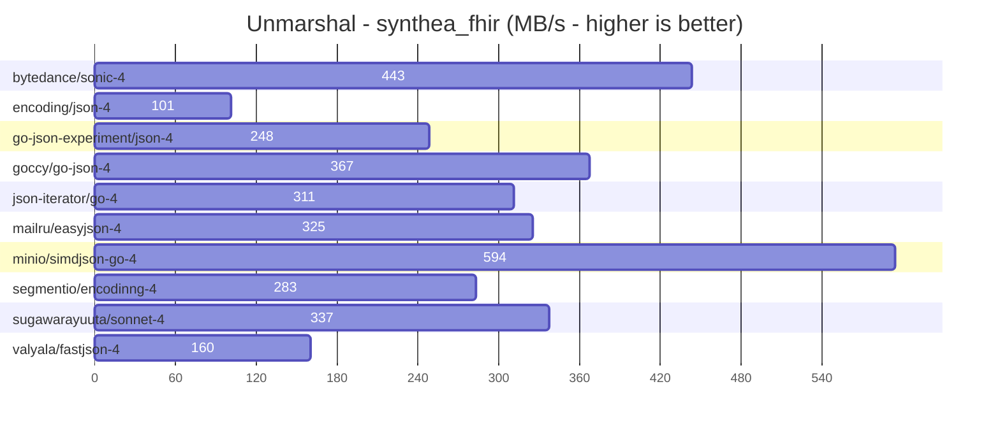
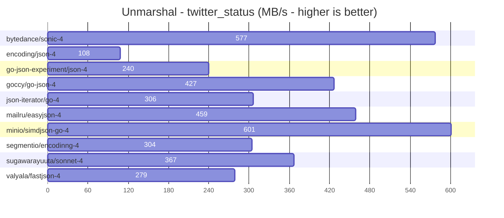

```mermaid
gantt
title Marshal - canada_geometry (MB/s - higher is better)
dateFormat X
axisFormat %s

section bytedance/sonic-4                 
397 :0, 397
section encoding/json-4         
140 :0, 140
section go-json-experiment/json-4         
137 :0, 137
section goccy/go-json-4                   
166 :0, 166
section json-iterator/go-4                
162 :0, 162
section mailru/easyjson-4                 
171 :0, 171
section segmentio/encodinng-4             
170 :0, 170
section sugawarayuuta/sonnet-4            
156 :0, 156
section wI2L/jettison-4                   
164 :0, 164
```

```mermaid
gantt
title Marshal - citm_catalog (MB/s - higher is better)
dateFormat X
axisFormat %s

section bytedance/sonic-4                    
3357 :0, 3357
section encoding/json-4                      
1332 :0, 1332
section go-json-experiment/json-4            
879 :0, 879
section goccy/go-json-4                      
2563 :0, 2563
section json-iterator/go-4                   
1369 :0, 1369
section mailru/easyjson-4                    
1789 :0, 1789
section segmentio/encodinng-4                
2106 :0, 2106
section sugawarayuuta/sonnet-4               
2057 :0, 2057
section wI2L/jettison-4                      
2013 :0, 2013
```

```mermaid
gantt
title Marshal - golang_source (MB/s - higher is better)
dateFormat X
axisFormat %s

section bytedance/sonic-4                   
1040 :0, 1040
section encoding/json-4                     
355 :0, 355
section go-json-experiment/json-4           
272 :0, 272
section goccy/go-json-4                     
542 :0, 542
section json-iterator/go-4                  
353 :0, 353
section mailru/easyjson-4                   
478 :0, 478
section segmentio/encodinng-4               
556 :0, 556
section sugawarayuuta/sonnet-4              
508 :0, 508
section wI2L/jettison-4                     
412 :0, 412
```

```mermaid
gantt
title Marshal - string_unicode (MB/s - higher is better)
dateFormat X
axisFormat %s

section bytedance/sonic-4                  
4243 :0, 4243
section encoding/json-4                    
466 :0, 466
section go-json-experiment/json-4          
522 :0, 522
section goccy/go-json-4                    
473 :0, 473
section json-iterator/go-4                 
506 :0, 506
section mailru/easyjson-4                  
540 :0, 540
section segmentio/encodinng-4              
444 :0, 444
section sugawarayuuta/sonnet-4             
559 :0, 559
section wI2L/jettison-4                    
490 :0, 490
```

```mermaid
gantt
title Marshal - synthea_fhir (MB/s - higher is better)
dateFormat X
axisFormat %s

section bytedance/sonic-4                    
407 :0, 407
section encoding/json-4                      
164 :0, 164
section go-json-experiment/json-4            
164 :0, 164
section goccy/go-json-4                      
315 :0, 315
section json-iterator/go-4                   
190 :0, 190
section mailru/easyjson-4                    
382 :0, 382
section segmentio/encodinng-4                
376 :0, 376
section sugawarayuuta/sonnet-4               
267 :0, 267
section wI2L/jettison-4                      
264 :0, 264
```

```mermaid
gantt
title Marshal - twitter_status (MB/s - higher is better)
dateFormat X
axisFormat %s

section bytedance/sonic-4                  
2361 :0, 2361
section encoding/json-4                    
623 :0, 623
section go-json-experiment/json-4          
490 :0, 490
section goccy/go-json-4                    
1008 :0, 1008
section json-iterator/go-4                 
510 :0, 510
section mailru/easyjson-4                  
810 :0, 810
section segmentio/encodinng-4              
942 :0, 942
section sugawarayuuta/sonnet-4             
846 :0, 846
section wI2L/jettison-4                    
710 :0, 710
```

```mermaid
gantt
title Unmarshal - canada_geometry (MB/s - higher is better)
dateFormat X
axisFormat %s

section bytedance/sonic-4               
367 :0, 367
section encoding/json-4                 
62 :0, 62
section go-json-experiment/json-4       
105 :0, 105
section goccy/go-json-4                 
150 :0, 150
section json-iterator/go-4              
81 :0, 81
section mailru/easyjson-4               
154 :0, 154
section minio/simdjson-go-4             
141 :0, 141
section segmentio/encodinng-4           
166 :0, 166
section sugawarayuuta/sonnet-4          
271 :0, 271
section valyala/fastjson-4              
72 :0, 72
```

```mermaid
gantt
title Unmarshal - citm_catalog (MB/s - higher is better)
dateFormat X
axisFormat %s

section bytedance/sonic-4                  
726 :0, 726
section encoding/json-4                    
112 :0, 112
section go-json-experiment/json-4          
356 :0, 356
section goccy/go-json-4                    
550 :0, 550
section json-iterator/go-4                 
414 :0, 414
section mailru/easyjson-4                  
395 :0, 395
section minio/simdjson-go-4                
722 :0, 722
section segmentio/encodinng-4              
577 :0, 577
section sugawarayuuta/sonnet-4             
511 :0, 511
section valyala/fastjson-4                 
164 :0, 164
```

```mermaid
gantt
title Unmarshal - golang_source (MB/s - higher is better)
dateFormat X
axisFormat %s

section bytedance/sonic-4                 
309 :0, 309
section encoding/json-4                   
73 :0, 73
section go-json-experiment/json-4         
137 :0, 137
section goccy/go-json-4                   
322 :0, 322
section json-iterator/go-4                
225 :0, 225
section mailru/easyjson-4                 
220 :0, 220
section minio/simdjson-go-4               
224 :0, 224
section segmentio/encodinng-4             
332 :0, 332
section sugawarayuuta/sonnet-4            
281 :0, 281
section valyala/fastjson-4                
98 :0, 98
```

```mermaid
gantt
title Unmarshal - string_unicode (MB/s - higher is better)
dateFormat X
axisFormat %s

section bytedance/sonic-4                
2401 :0, 2401
section encoding/json-4                  
165 :0, 165
section go-json-experiment/json-4        
389 :0, 389
section goccy/go-json-4                  
886 :0, 886
section json-iterator/go-4               
762 :0, 762
section mailru/easyjson-4                
1861 :0, 1861
section minio/simdjson-go-4              
513 :0, 513
section segmentio/encodinng-4            
207 :0, 207
section sugawarayuuta/sonnet-4           
396 :0, 396
section valyala/fastjson-4               
1805 :0, 1805
```

```mermaid
gantt
title Unmarshal - synthea_fhir (MB/s - higher is better)
dateFormat X
axisFormat %s

section bytedance/sonic-4                  
443 :0, 443
section encoding/json-4                    
101 :0, 101
section go-json-experiment/json-4          
248 :0, 248
section goccy/go-json-4                    
367 :0, 367
section json-iterator/go-4                 
311 :0, 311
section mailru/easyjson-4                  
325 :0, 325
section minio/simdjson-go-4                
594 :0, 594
section segmentio/encodinng-4              
283 :0, 283
section sugawarayuuta/sonnet-4             
337 :0, 337
section valyala/fastjson-4                 
160 :0, 160
```

```mermaid
gantt
title Unmarshal - twitter_status (MB/s - higher is better)
dateFormat X
axisFormat %s

section bytedance/sonic-4                
577 :0, 577
section encoding/json-4                  
108 :0, 108
section go-json-experiment/json-4        
240 :0, 240
section goccy/go-json-4                  
427 :0, 427
section json-iterator/go-4               
306 :0, 306
section mailru/easyjson-4                
459 :0, 459
section minio/simdjson-go-4              
601 :0, 601
section segmentio/encodinng-4            
304 :0, 304
section sugawarayuuta/sonnet-4           
367 :0, 367
section valyala/fastjson-4               
279 :0, 279
```

